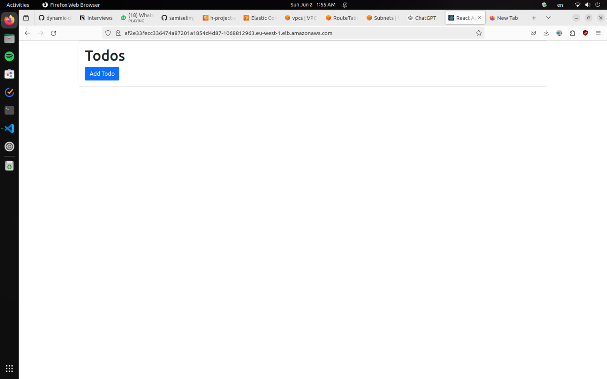

# Cloud-Native-App-Pipeline

### Results

## Project Overview

This project automates the build, and deployment of backend and frontend Docker images using Jenkins, and AWS ECR. The pipeline consists of multiple stages that handle different aspects of the CI/CD process, ensuring that the applications are built and deployed seamlessly. The entire infrastructure is created using Terraform, providing an Infrastructure as Code (IaC) approach for easy management and scalability.

## Prerequisites

- Jenkins (installed using Ansible)
- AWS CLI
- Docker
- AWS ECR Repositories
- AWS S3 Bucket
- GitHub Repository
- AWS CloudWatch Agent (installed on all nodes)
- AWS Backup Service (configured for daily snapshots of Jenkins instance)
- Terraform

## Pipeline Configuration

The Jenkins pipeline is defined in Jenkinsfile in this Repo

## Steps to Set Up the Project

1. **Create Infrastructure with Terraform**: Use Terraform scripts to create the necessary infrastructure on AWS.
2. **Install Jenkins**: Set up Jenkins on your preferred platform using Ansible.
3. **Configure AWS CLI**: Ensure that AWS CLI is installed and configured with necessary permissions.
4. **Set Up Docker**: Install Docker on the Jenkins server.
5. **Create ECR Repositories**: Create ECR repositories for the backend and frontend images.
6. **Set Up AWS S3 Bucket**: Create an S3 bucket to store security scan reports.
7. **Configure Jenkins Credentials**:
   - AWS credentials (`aws_access_key` and `aws_secret_key`)
   - GitHub token (`github_tocken`)
8. **Set Up GitHub Repository**: Ensure your codebase is hosted on GitHub.
9. **Install CloudWatch Agent**: Use Ansible to install the CloudWatch agent on all nodes.
10. **Configure AWS Backup**: Set up AWS Backup to take daily snapshots of the Jenkins instance.

## Conclusion

This project demonstrates a complete CI/CD pipeline using Jenkins and AWS services. The automation ensures that your backend and frontend applications are built and deployed efficiently, providing a robust DevOps workflow.

Feel free to contribute and make improvements to this project. Happy DevOps!
